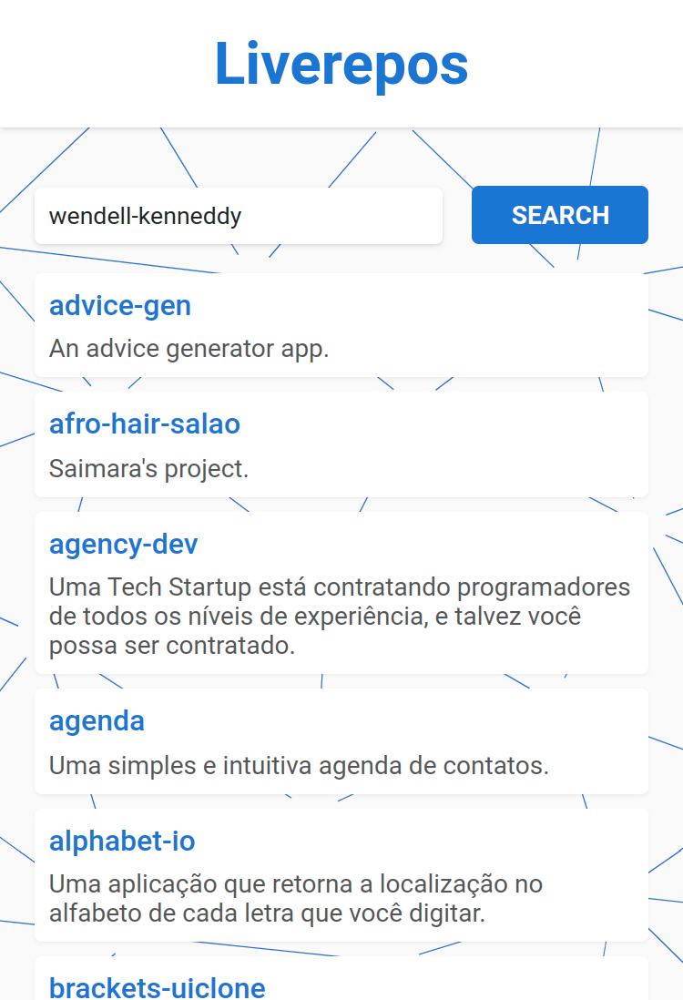

# Liverepos

---

## 📕 About

Liverepos lists all repositories with a preview URL from a user.

---

## ⚒️ Used Technologies

To develop this app, I used these technologies:

- Svelte
- Vite

---

## ✨ Features

- Responsivity
- Listing repositories

---

## ⚙️ How to Use

First, clone the repository.

Inside the project folder, run `npm install` to install the dependencies.

Then, run `npm run dev` to start a local development server.

---

## 🤝 Be a Contributor

Have any idea that can help boost the project, and want to share it? It's simple!

1. Fork the project
2. Modify what you want
3. Commit the changes
4. Open a Pull Request

---

## 🔓 License

This project is under license. Click [here](./LICENSE.md) for details.
